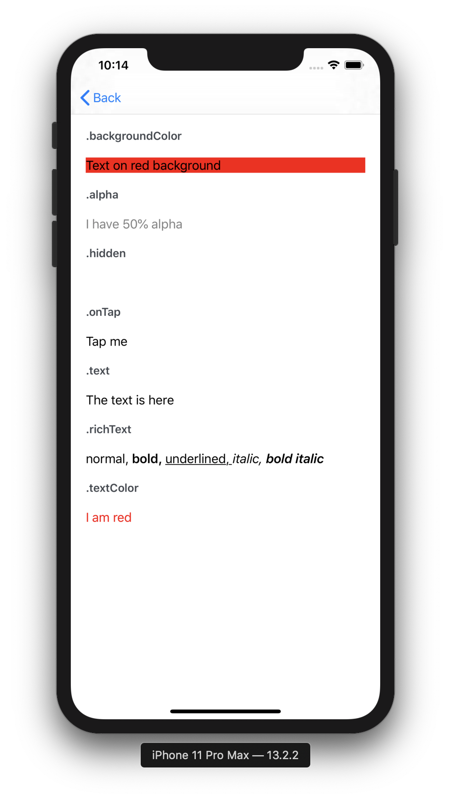

# Trikot.metaviews
Metaviews expose properties that can be binded to Android or iOS UI components. It allows 2 way interactions between Kotlin Multiplatform Common Code and platform UI.

Its a functionnal Meta abstraction of visual components.

This library does not provide platform specific attributes (layout, caps, borders, corners). We have decided to draw the line at simple color properties.

## The basics
Both iOS and Android comes with a binding library that supports basics UI components (View, Label, Button, Input, Image) designed to be bound to their meta equivalent (`MetaView`, `MetaLabel`, `MetaButton`, `MetaImage`, ect...). Since `MetaViews` are interfaces that are not meant to be modified, Mutable implementations are included to create each type of MetaView (`MutableMetaView`, `MutableMetaLabel`, `MutableMetaButton`, `MutableMetaImage`, ect...). We suggest that custom MetaView definition and implementation follow the same pattern.

All properties are reactive and observed by the platforms. They are ReactiveStreams `Publisher<T>`. See [Trikot.streams](https://github.com/mirego/trikot.streams) for more inforamtion about Publishers.

Additionally, you can easily replace a property with another `org.reactivestreams.Publisher<T>` (Like a Flow Coroutine per example).

See (Sample application)[https://github.com/mirego/trikot.metaviews/tree/master/sample] for all possibilities. 

iOS UILabel             |  Android TextView
:-------------------------:|:-------------------------:
  |  

### Interfaces provides documentation
- [MetaView](https://github.com/mirego/trikot.metaviews/blob/master/metaviews/src/commonMain/kotlin/com/mirego/trikot/metaviews/MetaView.kt)
- [MetaButton](https://github.com/mirego/trikot.metaviews/blob/master/metaviews/src/commonMain/kotlin/com/mirego/trikot/metaviews/MetaButton.kt)
- [MetaLabel](https://github.com/mirego/trikot.metaviews/blob/master/metaviews/src/commonMain/kotlin/com/mirego/trikot/metaviews/MetaLabel.kt)
- [MetaImage](https://github.com/mirego/trikot.metaviews/blob/master/metaviews/src/commonMain/kotlin/com/mirego/trikot/metaviews/MetaImage.kt)
- [MetaInputText](https://github.com/mirego/trikot.metaviews/blob/master/metaviews/src/commonMain/kotlin/com/mirego/trikot/metaviews/MetaInputText.kt)


## Multiplatform Sample
#### Common code
```kotlin
class SearchViewModel() {
    private val numberOfClickPublisher = Publishers.behaviorSubject(0)
    private val labelTextPublisher = numberOfClickPublisher.map { "Clicked $it times" }
    private val metaLabel = MutableMetaLabel().also {
        it.text = labelTextPublisher
    }
    private val metaButton = MutableMetaButton().also {
        it.text = "Click Me".just() // .just() Transform any value into Single Publisher of this value
        it.onTap.value = MetaAction { numberOfClickPublisher.value += 1 }.just()
    }
}
```

#### iOS
See [swift extensions](./swift-extensions/README.md) for more information.

Helps connect a publisher to a variable in a reactive environment.
```kotlin
let label = UILabel()
let button = UIButton()
label.metaLabel = searchViewModel.metaLabel
button.metaButton = searchViewModel.metaButton
```

#### Android
See [android extensions](./android-ktx/README.md) for more information.
```kotlin
 <TextView
            ...
            core:meta_view="@{searchViewModel.metaLabel}"
            app:lifecycleOwnerWrapper="@{lifecycleOwnerWrapper}"
            />
 <Button
            ...
            core:meta_view="@{searchViewModel.metaButton}"
            app:lifecycleOwnerWrapper="@{lifecycleOwnerWrapper}"
            />
```

## Installation
##### Import dependencies
```groovy
    api "com.mirego.trikot:metaviews:$trikot_metaviews_version"
    jvm "com.mirego.trikot:metaviews-jvm:$trikot_metaviews_version"
    js "com.mirego.trikot:metaviews-js:$trikot_metaviews_version"
    iosx64 "com.mirego.trikot:metaviews-iosx64:$trikot_metaviews_version"
    iosarm64 "com.mirego.trikot:metaviews-iosarm64:$trikot_metaviews_version"
```
## License

Trikot.metaviews is © 2018-2019 [Mirego](https://www.mirego.com) and may be freely distributed under the [New BSD license](http://opensource.org/licenses/BSD-3-Clause). See the [`LICENSE.md`](https://github.com/mirego/trikot.metaviews/blob/master/LICENSE.md) file.

## About Mirego

[Mirego](https://www.mirego.com) is a team of passionate people who believe that work is a place where you can innovate and have fun. We’re a team of [talented people](https://life.mirego.com) who imagine and build beautiful Web and mobile applications. We come together to share ideas and [change the world](http://www.mirego.org).

We also [love open-source software](https://open.mirego.com) and we try to give back to the community as much as we can.
